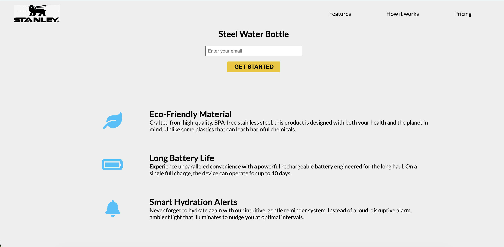

# Landing-Page-Stanley
 
 

---
## 🚀 About

This project is a static HTML/CSS landing page showcasing a product (e.g., smart bottle with features and pricing options). It’s designed with simplicity, clarity, and responsiveness in mind — perfect for learning how to build landing pages and for showcasing product offerings on a single page.

--- 

## 📦 Features

- 🖼️ Hero section with product highlight

- 💡 Feature sections (e.g., eco-friendly materials, hydration alerts)

- 💰 Pricing cards with selectable plans

- 📱 Responsive layout for most screen sizes

- 📄 Simple footer with links

- 📍 Hosted statically on GitHub Pages

---

## 🧩 How It Works

This is a static page built with HTML and CSS, no backend needed. The navigation anchors (Features, How it works, Pricing) link to sections on the same page. The pricing cards show different product tiers. You can customize text and images to suit your product.

---

## 🖼 Preview

  

---

## 🌐 Live Demo

Try it live:  
[https://bayardorj.github.io/Landing-Page-Stanley/](https://bayardorj.github.io/Landing-Page-Stanley/)

---

## 🛠 Technologies Used

- HTML5  
- CSS3  
- Git & GitHub Pages   

---

## 📄 License

MIT License © Bayardorj Dagdandorj

